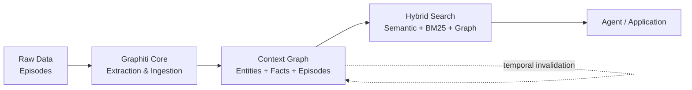
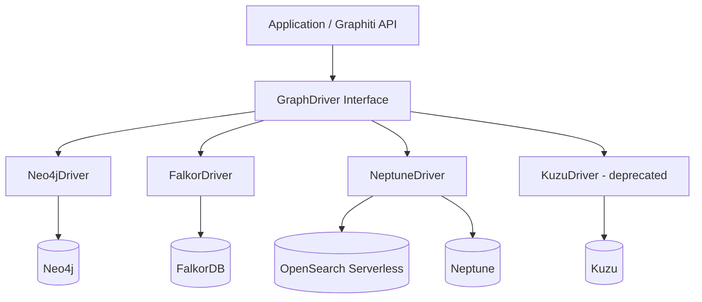
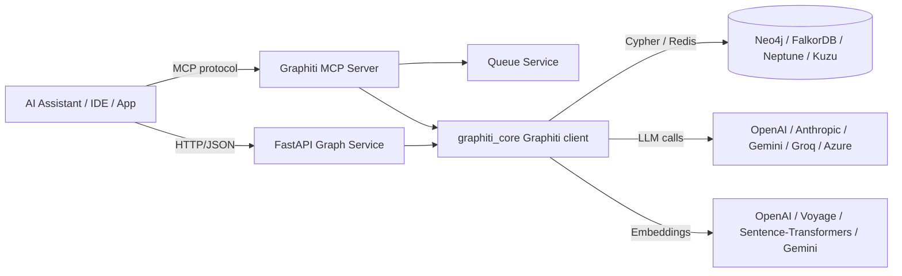

# Human Manual

## What This Pack Helps With

give AI coding hosts a source-backed Graphiti memory workflow with graph updates, backend choices, retrieval checks, and contradiction boundaries

## How To Use

1. Read `README.md`.
2. Load `AGENTS.md` or `CLAUDE.md`.
3. Run evals.
4. Use pitfall and risk files to recover from failure.

## What This Pack Does Not Do

- It does not replace upstream docs.
- It does not prove production readiness.
- It does not claim official endorsement.

## Doramagic Source Extract

# https://github.com/getzep/graphiti Project Manual

Generated at: 2026-06-11 16:26:19 UTC

## Table of Contents

- [Introduction to Graphiti and Core Concepts](#page-1)
- [Graph Database Backends and Driver Architecture](#page-2)
- [LLM Clients, Embedders, and Cross-Encoders](#page-3)
- [Deployment, MCP Server, REST Service, and Operations](#page-4)

<a id='page-1'></a>

## Introduction to Graphiti and Core Concepts

### Related Pages

Related topics: [Graph Database Backends and Driver Architecture](#page-2), [LLM Clients, Embedders, and Cross-Encoders](#page-3)

<details>
<summary>Related Source Files</summary>

The following source files were used to generate this page:

- [README.md](https://github.com/getzep/graphiti/blob/main/README.md)
- [examples/quickstart/README.md](https://github.com/getzep/graphiti/blob/main/examples/quickstart/README.md)
- [examples/azure-openai/README.md](https://github.com/getzep/graphiti/blob/main/examples/azure-openai/README.md)
- [mcp_server/README.md](https://github.com/getzep/graphiti/blob/main/mcp_server/README.md)
- [mcp_server/src/models/entity_types.py](https://github.com/getzep/graphiti/blob/main/mcp_server/src/models/entity_types.py)
- [mcp_server/src/models/edge_types.py](https://github.com/getzep/graphiti/blob/main/mcp_server/src/models/edge_types.py)
- [mcp_server/src/graphiti_mcp_server.py](https://github.com/getzep/graphiti/blob/main/mcp_server/src/graphiti_mcp_server.py)
- [server/README.md](https://github.com/getzep/graphiti/blob/main/server/README.md)
</details>

# Introduction to Graphiti and Core Concepts

## Overview

Graphiti is an open-source framework for building and querying **temporal context graphs** for AI agents. Unlike static knowledge graphs, Graphiti's context graphs track how facts change over time, maintain provenance to source data, and support both prescribed and learned ontology — making them purpose-built for agents operating on evolving, real-world data. Source: [README.md](https://github.com/getzep/graphiti/blob/main/README.md)

The framework continuously integrates user interactions, structured and unstructured enterprise data, and external information into a coherent, queryable graph. It supports incremental data updates, efficient retrieval, and precise historical queries without requiring complete graph recomputation, which is particularly valuable for developing interactive, context-aware AI applications. Source: [README.md](https://github.com/getzep/graphiti/blob/main/README.md)

Graphiti is the open-source temporal context graph engine at the core of [Zep's](https://www.getzep.com) context infrastructure for AI agents. Zep manages context graphs at scale with governed, low-latency context retrieval for production agent deployments. Source: [README.md](https://github.com/getzep/graphiti/blob/main/README.md)

## What is a Context Graph?

A **context graph** is a temporal graph of entities, relationships, and facts — for example, *"Kendra loves Adidas shoes (as of March 2026)."* Unlike traditional knowledge graphs, each fact in a context graph has a **validity window**: when it became true, and when (if ever) it was superseded. Entities evolve over time with updated summaries, and everything traces back to **episodes** — the raw data that produced it. Source: [README.md](https://github.com/getzep/graphiti/blob/main/README.md)

A context graph contains four core components:

| Component | What it stores |
|-----------|---------------|
| **Entities** (nodes) | People, products, policies, concepts — with summaries that evolve over time |
| **Facts / Relationships** (edges) | Triplets (Entity → Relationship → Entity) with temporal validity windows |
| **Episodes** (provenance) | Raw data as ingested — the ground truth stream. Every derived fact traces back here |
| **Custom Types** (ontology) | Developer-defined entity and edge types via Pydantic models |

Source: [README.md](https://github.com/getzep/graphiti/blob/main/README.md)

## Why Graphiti vs. Traditional RAG

Traditional RAG approaches rely on batch processing and static data summarization, making them inefficient for frequently changing data. Graphiti addresses these challenges through:

- **Temporal Fact Management** — Facts have validity windows. When information changes, old facts are invalidated — not deleted. You can query what's true now, or what was true at any point in time.
- **Episodes & Provenance** — Every entity and relationship traces back to the episodes (raw data) that produced it, providing full lineage from derived fact to source.
- **Hybrid Retrieval** — Queries span time, meaning, and relationships using semantic + keyword + graph traversal combined. Source: [README.md](https://github.com/getzep/graphiti/blob/main/README.md)

The framework is specifically designed for dynamic and frequently updated datasets, making it suitable for applications requiring real-time interaction and precise historical queries, with typical sub-second query latency. Source: [README.md](https://github.com/getzep/graphiti/blob/main/README.md)

## Graphiti and Zep

Graphiti is the open-source core, while Zep is the managed context graph infrastructure. Zep manages vast numbers of per-user/entity context graphs with governance, while Graphiti lets you build and query individual context graphs. Zep provides built-in user/thread/message storage, pre-configured retrieval with sub-200ms performance at scale, dashboards, and SDKs; Graphiti is self-hosted and requires you to build surrounding tooling. Source: [README.md](https://github.com/getzep/graphiti/blob/main/README.md)

The choice depends on your needs: **Zep** for turnkey, enterprise-grade platform with security, performance, and support; **Graphiti** for a flexible OSS core when you are comfortable building and operating the surrounding system. Source: [README.md](https://github.com/getzep/graphiti/blob/main/README.md)

## Core Architecture and Components

The Graphiti data flow can be visualized as follows:



Graphiti ingests raw data as **episodes** (text, messages, or JSON), extracts entities and relationships, then stores them in a graph database with full temporal tracking. Retrieval uses a combination of semantic embeddings, keyword (BM25) matching, and graph traversal to provide rich, context-aware results to the calling agent. Source: [README.md](https://github.com/getzep/graphiti/blob/main/README.md), [examples/quickstart/README.md](https://github.com/getzep/graphiti/blob/main/examples/quickstart/README.md)

The quickstart example demonstrates the basic workflow: connecting to a Neo4j or FalkorDB database, initializing Graphiti indices and constraints, adding episodes to the graph, and performing hybrid search with reranking using the top search result's source node UUID. Source: [examples/quickstart/README.md](https://github.com/getzep/graphiti/blob/main/examples/quickstart/README.md)

## Custom Entity and Edge Types

A distinguishing feature of Graphiti is the ability to define a custom ontology through Pydantic models. The MCP server ships with built-in rich entity types such as `Requirement`, `Preference`, `Procedure`, `Location`, `Event`, `Organization`, and `Document`, each with typed attributes and extraction instructions. Source: [mcp_server/README.md](https://github.com/getzep/graphiti/blob/main/mcp_server/README.md), [mcp_server/src/models/entity_types.py](https://github.com/getzep/graphiti/blob/main/mcp_server/src/models/entity_types.py)

For example, a `Requirement` model captures a specific need or functionality with a `project_name` and `description` field, while a `Preference` model classifies user preferences, choices, or opinions with low-threshold sensitivity. Source: [mcp_server/src/models/entity_types.py](https://github.com/getzep/graphiti/blob/main/mcp_server/src/models/entity_types.py)

Edge types describe the kind of relationship a fact represents between two entities. They are registered via `add_episode`'s `edge_types` argument and constrained to specific source/target entity-type pairs via an `edge_type_map`. Examples include `RelatesTo`, `MentionedIn`, `WorksFor`, `LocatedAt`, `ParticipatesIn`, `Owns`, and `Requires` — each with optional typed attributes extracted by the LLM from episode content. Source: [mcp_server/src/models/edge_types.py](https://github.com/getzep/graphiti/blob/main/mcp_server/src/models/edge_types.py)

## Storage Backends and LLM Providers

Graphiti supports multiple graph database backends — Neo4j 5.26, FalkorDB 1.1.2, Amazon Neptune Database Cluster or Neptune Analytics (with Amazon OpenSearch Serverless for full-text search), and Kuzu 0.11.2 (deprecated). It defaults to OpenAI for LLM inference and embedding, but works with any service that supports structured output. Source: [README.md](https://github.com/getzep/graphiti/blob/main/README.md), [examples/quickstart/README.md](https://github.com/getzep/graphiti/blob/main/examples/quickstart/README.md)

A FastAPI server (`zepai/graphiti` on Docker Hub) is provided as a RESTful API service for interacting with Graphiti, automatically built and published when a new `graphiti-core` version is released to PyPI. Source: [server/README.md](https://github.com/getzep/graphiti/blob/main/server/README.md)

## Community Discussion

The community has expressed strong interest in expanding the storage and LLM ecosystem. Open issues include support for **Amazon Bedrock** (issue #459), **MemGraph** (issue #642), **RDF-based knowledge graphs** (issue #933), and **Postgres with pgvector** (issue #779). Broader feedback in issue #248 calls for a generic graph-store interface to decouple Graphiti from Neo4j. The latest release (v0.29.2) included FalkorDB-specific bug fixes — for example, stripping NUL bytes from parameters (PR #1531) and resolving a FalkorDB profile startup issue in docker-compose (PR #1126) — reflecting active maintenance of the existing backends.

## See Also

- [Quick Start Guide](https://help.getzep.com/graphiti/graphiti/quick-start)
- [Building an agent with LangChain's LangGraph and Graphiti](https://help.getzep.com/graphiti/integrations/lang-graph-agent)
- [Zep paper: A Temporal Knowledge Graph Architecture for Agent Memory](https://arxiv.org/abs/2501.13956)

---

<a id='page-2'></a>

## Graph Database Backends and Driver Architecture

### Related Pages

Related topics: [Introduction to Graphiti and Core Concepts](#page-1), [Deployment, MCP Server, REST Service, and Operations](#page-4)

<details>
<summary>Related Source Files</summary>

The following source files were used to generate this page:

- [README.md](https://github.com/getzep/graphiti/blob/main/README.md)
- [graphiti_core/driver/driver.py](https://github.com/getzep/graphiti/blob/main/graphiti_core/driver/driver.py)
- [graphiti_core/driver/neo4j_driver.py](https://github.com/getzep/graphiti/blob/main/graphiti_core/driver/neo4j_driver.py)
- [graphiti_core/driver/falkordb_driver.py](https://github.com/getzep/graphiti/blob/main/graphiti_core/driver/falkordb_driver.py)
- [graphiti_core/driver/kuzu_driver.py](https://github.com/getzep/graphiti/blob/main/graphiti_core/driver/kuzu_driver.py)
- [graphiti_core/driver/neptune_driver.py](https://github.com/getzep/graphiti/blob/main/graphiti_core/driver/neptune_driver.py)
- [graphiti_core/driver/operations/graph_ops.py](https://github.com/getzep/graphiti/blob/main/graphiti_core/driver/operations/graph_ops.py)
- [examples/quickstart/README.md](https://github.com/getzep/graphiti/blob/main/examples/quickstart/README.md)
- [mcp_server/README.md](https://github.com/getzep/graphiti/blob/main/mcp_server/README.md)
- [mcp_server/src/graphiti_mcp_server.py](https://github.com/getzep/graphiti/blob/main/mcp_server/src/graphiti_mcp_server.py)
</details>

# Graph Database Backends and Driver Architecture

Graphiti is designed to be database-agnostic at the application layer, with a thin driver abstraction that lets the same temporal context graph engine run on multiple graph storage backends. This page describes the driver architecture, the currently supported backends, configuration patterns, and the community-driven roadmap for additional stores.

## 1. Purpose and Scope

The driver layer is responsible for everything below the graph logic: connection management, query execution, transaction handling, parameter escaping, and backend-specific schema/index setup. The higher-level code in `graphiti_core` works against the abstract `GraphDriver` interface rather than any specific database, which means the same `Graphiti` API (`add_episode`, `search`, etc.) works across every supported backend.

As stated in the README, Graphiti requires one of several graph databases to operate:

> Neo4j 5.26 / FalkorDB 1.1.2 / Amazon Neptune Database Cluster or Neptune Analytics Graph + Amazon OpenSearch Serverless collection (serves as the full text search backend) / Kuzu 0.11.2 (**deprecated**, see below) — Source: [README.md](https://github.com/getzep/graphiti/blob/main/README.md)

The driver abstraction is the seam that makes this multi-backend story possible. It also isolates the rest of the codebase from Cypher dialect differences (e.g., FalkorDB vs. Neo4j), full-text search backend choices, and database-specific identifier rules.

## 2. Supported Backends

| Backend | Driver module | Status | Notes |
|---------|---------------|--------|-------|
| Neo4j | `graphiti_core/driver/neo4j_driver.py` | Supported | Default backend; uses Bolt protocol; database name defaults to `neo4j` |
| FalkorDB | `graphiti_core/driver/falkordb_driver.py` | Supported | Redis-compatible graph; database name defaults to `default_db` |
| Amazon Neptune | `graphiti_core/driver/neptune_driver.py` | Supported | Requires Amazon OpenSearch Serverless for full-text search |
| Kuzu | `graphiti_core/driver/kuzu_driver.py` | **Deprecated** | Kuzu 0.11.2 is the last supported version |

The MCP server demonstrates the same pattern at a higher level — it accepts a `database` parameter and configures the appropriate driver internally, with FalkorDB as the default and Neo4j as an alternative. Source: [mcp_server/README.md](https://github.com/getzep/graphiti/blob/main/mcp_server/README.md).

### 2.1 Neo4j

Neo4j is the original and most fully featured backend. The driver connects over the Bolt protocol and uses standard Cypher plus Neo4j's native full-text indexes for BM25-style search. The default database name `neo4j` is hardcoded in `Neo4jDriver`; custom databases require an explicit driver instance. Source: [README.md](https://github.com/getzep/graphiti/blob/main/README.md).

### 2.2 FalkorDB

FalkorDB is a Redis-based graph database. The driver uses a different connection scheme and parameter-passing semantics than Neo4j; this is why backend-specific behavior such as stripping NUL bytes from parameters was needed in recent releases (v0.29.2). Source: [README.md](https://github.com/getzep/graphiti/blob/main/README.md).

### 2.3 Amazon Neptune

Neptune support is split between Neptune Database Cluster and Neptune Analytics Graph. Both rely on Amazon OpenSearch Serverless for full-text search, since Neptune itself does not provide native full-text indexing. Source: [README.md](https://github.com/getzep/graphiti/blob/main/README.md).

### 2.4 Kuzu (Deprecated)

Kuzu 0.11.2 remains in the codebase for backward compatibility, but is flagged as deprecated in the README. Users still on Kuzu are encouraged to migrate to FalkorDB or Neo4j. Source: [README.md](https://github.com/getzep/graphiti/blob/main/README.md).

## 3. Driver Architecture

The driver layer follows a standard abstraction pattern in `graphiti_core/driver/`:

```
graphiti_core/driver/
├── driver.py              # GraphDriver interface and shared types
├── neo4j_driver.py        # Neo4j implementation
├── falkordb_driver.py     # FalkorDB implementation
├── kuzu_driver.py         # Kuzu implementation (deprecated)
├── neptune_driver.py      # Amazon Neptune implementation
└── operations/
    └── graph_ops.py       # Backend-agnostic graph operation helpers
```



The base `GraphDriver` interface defines the contract for executing queries, managing sessions/transactions, and exposing search-provider capabilities. Each concrete driver translates this into the backend's native API. The shared `operations/graph_ops.py` module contains backend-agnostic helpers that each driver can reuse or specialize. Source: [graphiti_core/driver/driver.py](https://github.com/getzep/graphiti/blob/main/graphiti_core/driver/driver.py).

## 4. Configuration and Customization

Since v0.17.0, Graphiti allows users to instantiate a driver directly and pass it to the `Graphiti` constructor via the `graph_driver` parameter. This is the recommended way to use a non-default database name or to apply connection-pool tuning. Source: [README.md](https://github.com/getzep/graphiti/blob/main/README.md).

Example with a custom Neo4j database:

```python
from graphiti_core import Graphiti
from graphiti_core.driver.neo4j_driver import Neo4jDriver

driver = Neo4jDriver(
    uri="bolt://localhost:7687",
    user="neo4j",
    password="password",
    database="my_custom_database",
)

graphiti = Graphiti(graph_driver=driver)
```

Example with FalkorDB:

```python
from graphiti_core import Graphiti
from graphiti_core.driver.falkordb_driver import FalkorDriver

driver = FalkorDriver(uri="falkor://localhost:6379")
graphiti = Graphiti(graph_driver=driver)
```

Environment variables are honored when present (`NEO4J_URI`, `NEO4J_USER`, `NEO4J_PASSWORD`, `FALKORDB_URI`, `AZURE_OPENAI_*`, etc.) and the MCP server's `config.yaml` supports `${VAR_NAME}` expansion. Source: [mcp_server/README.md](https://github.com/getzep/graphiti/blob/main/mcp_server/README.md).

## 5. Community Requests and Roadmap

The driver architecture was deliberately designed to be extensible, and the community has consistently asked for additional backends:

- **Amazon Bedrock (LLM provider, not a graph store)** — Issue [#459](https://github.com/getzep/graphiti/issues/459) discusses LLM-provider parity, which sits next to the driver layer.
- **MemGraph** — Issue [#642](https://github.com/getzep/graphiti/issues/642) requests a `MemGraphDriver` analogous to the existing Neo4j driver. MemGraph speaks Cypher and Bolt, so a driver implementation would share much of the Neo4j transport code.
- **Postgres with pgvector** — Issue [#779](https://github.com/getzep/graphiti/issues/779) asks for a relational/vector hybrid backend. This would be a larger architectural change since Graphiti's data model relies on graph traversal, not joins plus vector search.
- **RDF / labeled property graphs** — Issue [#933](https://github.com/getzep/graphiti/issues/933) requests RDF support for semantic inference, which would require a different storage model than the current labeled-property-graph approach.
- **Generic graph-store interface** — Issue [#248](https://github.com/getzep/graphiti/issues/248) is the most architecturally significant: it asks for a backend-agnostic interface (which largely exists via `GraphDriver`) and a framework for implementing and benchmarking new drivers. The current `GraphDriver` interface is the foundation this work would build on.

The most recent release, v0.29.2, focused on FalkorDB stability — fixing NUL byte handling and Docker profile issues — which signals continued investment in the non-Neo4j backends. Source: [README.md](https://github.com/getzep/graphiti/blob/main/README.md).

## 6. Common Failure Modes

- **"Graph not found: default_db"** — The driver is connecting with a database name the server does not recognize. For Neo4j, the default is `neo4j`, not `default_db`. Fix by instantiating the driver with the correct `database` argument. Source: [examples/quickstart/README.md](https://github.com/getzep/graphiti/blob/main/examples/quickstart/README.md).
- **Azure OpenAI endpoint errors** — These are not driver issues but originate in the LLM client; verify endpoint format (`https://<resource>.openai.azure.com/openai/v1/`), deployment names, and API version. Source: [examples/azure-openai/README.md](https://github.com/getzep/graphiti/blob/main/examples/azure-openai/README.md).
- **FalkorDB parameter corruption** — Binary data containing NUL bytes must be sanitized before being passed to FalkorDB. This is handled in v0.29.2+; older versions may see query failures on certain payloads.

## See Also

- [Quickstart Example](../examples/quickstart/README.md)
- [Azure OpenAI Example](../examples/azure-openai/README.md)
- [Graphiti MCP Server](../mcp_server/README.md)
- [Zep vs Graphiti Comparison](README.md#zep-vs-graphiti)
- [Graphiti vs GraphRAG](README.md#graphiti-vs-graphrag)

---

<a id='page-3'></a>

## LLM Clients, Embedders, and Cross-Encoders

### Related Pages

Related topics: [Introduction to Graphiti and Core Concepts](#page-1), [Deployment, MCP Server, REST Service, and Operations](#page-4)

<details>
<summary>Related Source Files</summary>

The following source files were used to generate this page:

- [mcp_server/src/services/factories.py](https://github.com/getzep/graphiti/blob/main/mcp_server/src/services/factories.py)
- [mcp_server/src/graphiti_mcp_server.py](https://github.com/getzep/graphiti/blob/main/mcp_server/src/graphiti_mcp_server.py)
- [mcp_server/README.md](https://github.com/getzep/graphiti/blob/main/mcp_server/README.md)
- [README.md](https://github.com/getzep/graphiti/blob/main/README.md)
- [examples/azure-openai/README.md](https://github.com/getzep/graphiti/blob/main/examples/azure-openai/README.md)
- [mcp_server/src/services/queue_service.py](https://github.com/getzep/graphiti/blob/main/mcp_server/src/services/queue_service.py)
- [examples/quickstart/README.md](https://github.com/getzep/graphiti/blob/main/examples/quickstart/README.md)
- [graphiti_core/utils/content_chunking.py](https://github.com/getzep/graphiti/blob/main/graphiti_core/utils/content_chunking.py)
- [graphiti_core/utils/bulk_utils.py](https://github.com/getzep/graphiti/blob/main/graphiti_core/utils/bulk_utils.py)
- [mcp_server/src/models/entity_types.py](https://github.com/getzep/graphiti/blob/main/mcp_server/src/models/entity_types.py)
</details>

# LLM Clients, Embedders, and Cross-Encoders

## Overview

Graphiti is a temporal knowledge graph engine whose ingestion pipeline depends on two external model families: Large Language Model (LLM) clients that perform entity/edge extraction and summarization, and embedder clients that produce vector representations of facts, episodes, and nodes for hybrid retrieval. The library ships first-class clients for several major providers, plus a generic OpenAI-compatible client for routing to alternative or self-hosted services. A factory module in the MCP server (`mcp_server/src/services/factories.py`) handles the conditional import of optional providers so deployments can install only what they need. Source: [mcp_server/src/services/factories.py:1-30]()

The MCP server entry point in `mcp_server/src/graphiti_mcp_server.py` initializes a `GraphitiService` from a unified `GraphitiConfig`, which itself is composed of typed `LLMConfig`, `EmbedderConfig`, and `DatabaseConfig` sub-configs. The factory then resolves each sub-config to a concrete client. Source: [mcp_server/src/services/factories.py:11-20]()

## LLM Client Implementations

Graphiti defines a common `LLMClient` interface and provides concrete implementations per provider:

| Provider | Module | Notes |
|----------|--------|-------|
| OpenAI | `graphiti_core.llm_client.openai_client.OpenAIClient` | Default choice; works best with structured output |
| Anthropic | `graphiti_core.llm_client.anthropic_client` | Claude family |
| Google Gemini | `graphiti_core.llm_client.gemini_client` | Gemini models |
| Groq | `graphiti_core.llm_client.groq_client` | Groq-hosted models |
| Azure OpenAI | `graphiti_core.llm_client.azure_openai_client.AzureOpenAILLMClient` | Uses OpenAI v1 API endpoint |
| OpenAI-compatible | `graphiti_core.llm_client.openai_generic_client.OpenAIGenericClient` | For Bedrock, local servers, etc. |

Source: [mcp_server/src/services/factories.py:36-66]() and [README.md:73-105]().

The `OpenAIGenericClient` is the answer to the frequently-asked question of how to point Graphiti at Amazon Bedrock or a self-hosted OpenAI-compatible endpoint. It exposes a `structured_output_mode` setting that controls how extraction schemas are enforced: `"json_schema"` (default, native constrained decoding) and `"json_object"` (schema injected into the prompt, more reliable on smaller or local models that ignore the schema parameter). Source: [README.md:107-118]()

The Azure OpenAI example demonstrates the recommended pattern: instantiate `AsyncOpenAI` with `base_url=f"{azure_endpoint}/openai/v1/"` and pass it to `AzureOpenAILLMClient` and the embedder. Source: [examples/azure-openai/README.md:55-80]()

## Embedder Client Implementations

Embedders produce the dense vectors used by semantic search and the reranker stage. The supported providers mirror the LLM list plus a local option:

| Provider | Module | Notes |
|----------|--------|-------|
| OpenAI | `graphiti_core.embedder.OpenAIEmbedder` | Default |
| Azure OpenAI | `graphiti_core.embedder.azure_openai.AzureOpenAIEmbedderClient` | Separate deployment for embeddings |
| Google Gemini | `graphiti_core.embedder.gemini.GeminiEmbedder` | |
| Voyage AI | `graphiti_core.embedder.voyage.VoyageAIEmbedder` | |
| Sentence Transformers | local | No external API required |

Source: [mcp_server/README.md:31-45]() and [mcp_server/src/services/factories.py:22-35]().

The MCP server's `config.yaml` performs `${VAR}` expansion for all credential variables, including the optional `AZURE_OPENAI_EMBEDDINGS_ENDPOINT` and `AZURE_OPENAI_EMBEDDINGS_DEPLOYMENT` so embeddings can live on a different Azure deployment than the chat model. Source: [mcp_server/README.md:20-30]()

## Factory Pattern, Configuration, and Cross-Encoders

The factory uses `try/except ImportError` blocks so missing optional dependencies degrade gracefully to `HAS_*` booleans. This is how the same code base ships with or without the Groq, Voyage, or Gemini SDKs installed. Source: [mcp_server/src/services/factories.py:13-66]()

```python
try:
    from graphiti_core.embedder.voyage import VoyageAIEmbedder
    HAS_VOYAGE_EMBEDDER = True
except ImportError:
    HAS_VOYAGE_EMBEDDER = False
```

Source: [mcp_server/src/services/factories.py:30-35]().

Graphiti's hybrid search combines three signals: **semantic search** via embedder cosine similarity, **BM25** keyword retrieval, and **graph traversal** reranking against a center node. The `bulk_utils.py` dedupe path even uses word-overlap heuristics on edge facts to approximate BM25 in memory. Source: [graphiti_core/utils/bulk_utils.py:1-40]() and [examples/quickstart/README.md:23-31]()

For cross-encoder style reranking, Graphiti provides search "recipes" (e.g. `EDGE_HYBRID_SEARCH_RRF`, `NODE_HYBRID_SEARCH_RRF`, center-node reranking) in `graphiti_core.search.search_config_recipes`. The recipes combine the embedder's semantic scores with BM25 hits and an optional graph-distance rerank, which is functionally a cross-encoder-style rerank step that does not require a separate cross-encoder model. The Azure example also illustrates "Center Node Search" that reranks results based on graph distance to a chosen node. Source: [examples/azure-openai/README.md:18-25]() and [examples/quickstart/README.md:13-19]().

When adding long episodes, the `content_chunking` module only triggers chunking for inputs that are both large *and* high entity density, preserving prose context for narrative content. Source: [graphiti_core/utils/content_chunking.py:30-80]()

## Common Failure Modes

- **Rate limits (HTTP 429)**: Lower `SEMAPHORE_LIMIT`. Smaller or local models have limited concurrency, and the README explicitly recommends keeping the semaphore low. Source: [README.md:112-118]()
- **Schema-non-conforming output**: Switch `OpenAIGenericClient.structured_output_mode` to `"json_object"`, or upgrade to a more capable model. Markdown ` ```json ` fences are stripped automatically. Source: [README.md:115-118]()
- **Missing `default_db`**: The Neo4j driver defaults to database name `neo4j`; if the user creates a different database, the driver constructor must be updated. Source: [examples/quickstart/README.md:53-58]()
- **Bedrock not first-class**: Until a native `BedrockClient` is added (see community issue #459), route through `OpenAIGenericClient` with a `base_url` pointing at a Bedrock proxy. Source: [README.md:107-110]()

## See Also

- Graphiti README: [README.md](https://github.com/getzep/graphiti/blob/main/README.md)
- MCP server guide: [mcp_server/README.md](https://github.com/getzep/graphiti/blob/main/mcp_server/README.md)
- Azure OpenAI example: [examples/azure-openai/README.md](https://github.com/getzep/graphiti/blob/main/examples/azure-openai/README.md)
- Quickstart example: [examples/quickstart/README.md](https://github.com/getzep/graphiti/blob/main/examples/quickstart/README.md)
- Zep paper: [Zep: A Temporal Knowledge Graph Architecture for Agent Memory](https://arxiv.org/abs/2501.13956)
- Community issue #459 — Support for Amazon Bedrock
- Community issue #779 — Postgres (pgvector) storage engine request
- Community issue #248 — Generic graph-store interface request

---

<a id='page-4'></a>

## Deployment, MCP Server, REST Service, and Operations

### Related Pages

Related topics: [Graph Database Backends and Driver Architecture](#page-2), [LLM Clients, Embedders, and Cross-Encoders](#page-3)

<details>
<summary>Related Source Files</summary>

The following source files were used to generate this page:

- [mcp_server/README.md](https://github.com/getzep/graphiti/blob/main/mcp_server/README.md)
- [mcp_server/src/graphiti_mcp_server.py](https://github.com/getzep/graphiti/blob/main/mcp_server/src/graphiti_mcp_server.py)
- [mcp_server/src/services/queue_service.py](https://github.com/getzep/graphiti/blob/main/mcp_server/src/services/queue_service.py)
- [mcp_server/src/models/entity_types.py](https://github.com/getzep/graphiti/blob/main/mcp_server/src/models/entity_types.py)
- [mcp_server/src/config/schema.py](https://github.com/getzep/graphiti/blob/main/mcp_server/src/config/schema.py)
- [examples/azure-openai/README.md](https://github.com/getzep/graphiti/blob/main/examples/azure-openai/README.md)
- [examples/quickstart/README.md](https://github.com/getzep/graphiti/blob/main/examples/quickstart/README.md)
- [README.md](https://github.com/getzep/graphiti/blob/main/README.md)
</details>

# Deployment, MCP Server, REST Service, and Operations

## Overview

Graphiti is an open-source temporal knowledge graph engine designed for AI agents that need to ingest, retrieve, and reason over continuously changing context. Beyond the core `graphiti_core` library, the project ships production-oriented operational surfaces: an **MCP (Model Context Protocol) server** that exposes graph operations to AI assistants, a **FastAPI REST service** for programmatic HTTP access, and supporting **operational tooling** (Docker Compose stacks, configuration, queueing, and semaphore-based concurrency controls). Together these pieces form the deployment story of Graphiti and are what operators actually run in development and production.

The repo's installation requirements outline the supported substrate: Python 3.10+, Neo4j 5.26, FalkorDB 1.1.2, Amazon Neptune (Database Cluster or Neptune Analytics with OpenSearch Serverless), or Kuzu 0.11.2 (now deprecated), plus an OpenAI-compatible LLM service. Source: [README.md](https://github.com/getzep/graphiti/blob/main/README.md).

## Architecture and Component Topology



The MCP server is built on `FastMCP` and is described in the source as an "experimental Model Context Protocol (MCP) server implementation for Graphiti" that exposes graph capabilities to AI assistants. Source: [mcp_server/src/graphiti_mcp_server.py:1-50](). It registers a single global `GraphitiService` plus a `QueueService` that serializes expensive ingestion work behind an `asyncio.Semaphore`.

## MCP Server: Tools, Configuration, and Concurrency

The MCP server implements the standard MCP tool surface, including `add_episode`/`add_memory` (text, message, and JSON sources), search (facts, nodes, hybrid), episode/entity CRUD, group management, and saga/community utilities. Source: [mcp_server/src/graphiti_mcp_server.py:50-200](). Episodes are queued and processed asynchronously; the `QueueService.add_episode_task` method handles back-pressure and forwards each episode to the underlying `Graphiti` ingestion pipeline. Source: [mcp_server/src/services/queue_service.py:1-50]().

Configuration uses a layered system: `config.yaml` → environment variables (`${VAR}` or `${VAR:default}` expansion) → CLI flags, in increasing precedence. The `YamlSettingsSource` class in [mcp_server/src/config/schema.py](https://github.com/getzep/graphiti/blob/main/mcp_server/src/config/schema.py) implements the env-var expansion logic, including boolean coercion for strings like `"true"`/`"false"`. The shipped default config enables the built-in rich entity types (Preference, Requirement, Procedure, Location, Event, Organization, Document, etc.) defined in [mcp_server/src/models/entity_types.py](https://github.com/getzep/graphiti/blob/main/mcp_server/src/models/entity_types.py). Setting `graphiti.entity_types` to an empty list reverts to attribute-free extraction.

### Concurrency Tuning

A documented `SEMAPHORE_LIMIT` in `graphiti_mcp_server.py` controls how many episodes process in parallel. Each episode triggers multiple LLM calls, so this is a critical operational knob. Recommended settings vary by LLM tier:

| Provider / Tier | RPM | Suggested `SEMAPHORE_LIMIT` |
|----------------|-----|------------------------------|
| OpenAI Tier 1 (free) | 3 | 1–2 |
| OpenAI Tier 2 | 60 | 5–8 |
| OpenAI Tier 3 | 500 | 10–15 |
| OpenAI Tier 4 | 5,000 | 20–50 |
| Anthropic (default) | 50 | 5–8 |
| Anthropic (high) | 1,000 | 15–30 |

Source: [mcp_server/src/graphiti_mcp_server.py:80-130]().

## Database and LLM Provider Pluggability

The MCP server supports multiple backends out of the box: FalkorDB (default, Redis-based, bundled in the Docker image), Neo4j (for production), and the core's broader list of supported stores. Source: [mcp_server/README.md](https://github.com/getzep/graphiti/blob/main/mcp_server/README.md). Community demand remains strong for additional backends — see issues [#642](https://github.com/getzep/graphiti/issues/642) (MemGraph), [#779](https://github.com/getzep/graphiti/issues/779) (Postgres + pgvector), [#248](https://github.com/getzep/graphiti/issues/248) (generic graph store interface), and [#933](https://github.com/getzep/graphiti/issues/933) (RDF), as well as [#459](https://github.com/getzep/graphiti/issues/459) for Amazon Bedrock on the LLM side. None of these are first-class today, so operators needing them must build custom drivers or wait for upstream.

For LLM providers, the server accepts OpenAI, Anthropic, Gemini, Groq, and Azure OpenAI; embeddings support OpenAI, Voyage, Sentence-Transformers, and Gemini. Required environment variables (`OPENAI_API_KEY`, `ANTHROPIC_API_KEY`, `GOOGLE_API_KEY`, `GROQ_API_KEY`, `AZURE_OPENAI_*`) are documented in the MCP README. The Azure OpenAI example in [examples/azure-openai/README.md](https://github.com/getzep/graphiti/blob/main/examples/azure-openai/README.md) shows the deployment pattern: an `AsyncOpenAI` client pointed at the Azure `openai/v1/` endpoint plus a `Neo4jDriver`, then `AzureOpenAILLMClient` instantiation. Troubleshooting guidance there addresses common 401/404 errors and Neo4j `bolt://` vs `neo4j://` URI confusion.

## Deployment Patterns and Common Failure Modes

The recommended local path is `docker compose up`, which boots a combined FalkorDB + MCP server container exposing the MCP endpoint at `http://localhost:8000/mcp/`. Cursor IDE integration requires only a JSON entry pointing at that URL, plus the rule file in `mcp_server/cursor_rules.md`. Source: [mcp_server/README.md](https://github.com/getzep/graphiti/blob/main/mcp_server/README.md).

Frequent operational pitfalls worth flagging:

- **Database not found**: The Neo4j driver defaults to the `neo4j` database; pointing it at `default_db` raises `Neo.ClientError.Database.DatabaseNotFound`. Fix by passing an explicit `database=` argument. Source: [examples/quickstart/README.md](https://github.com/getzep/graphiti/blob/main/examples/quickstart/README.md).
- **FalkorDB parameter errors**: Recent releases (v0.29.2) shipped fixes for NUL bytes in parameters and for the FalkorDB profile failing to start in Docker Compose — a reminder to pin to a recent tag in production. Source: GitHub release notes.
- **Reference-time parsing**: The server pre-validates `reference_time` strings before queuing; malformed timestamps return an `ErrorResponse` immediately rather than failing silently in the background. Source: [mcp_server/src/graphiti_mcp_server.py:200-260]().
- **Custom-type upgrade**: Enabling the default `entity_types` in `config.yaml` changes extraction behavior on existing deployments; operators who want legacy attribute-free output must clear the list. Source: [mcp_server/README.md](https://github.com/getzep/graphiti/blob/main/mcp_server/README.md).

## See Also

- Graphiti Core library and `graphiti_core.Graphiti` client
- `mcp_server/cursor_rules.md` for IDE integration rules
- `examples/quickstart/` and `examples/azure-openai/` for runnable deployment templates
- `graphiti_core.search.search_config_recipes` for available search recipes
- `docker-compose.yml` at the repo root for the bundled FalkorDB profile
- Related community discussions: [#248](https://github.com/getzep/graphiti/issues/248), [#459](https://github.com/getzep/graphiti/issues/459), [#642](https://github.com/getzep/graphiti/issues/642), [#779](https://github.com/getzep/graphiti/issues/779), [#933](https://github.com/getzep/graphiti/issues/933)

---

<!-- evidence_pipeline_checked: true -->
<!-- evidence_injected: true -->

---

## Pitfall Log

Project: getzep/graphiti

Summary: Found 10 structured pitfall item(s), including 2 high/blocking item(s). Top priority: Installation risk - Installation risk requires verification.

## 1. Installation risk - Installation risk requires verification

- Severity: high
- Evidence strength: source_linked
- Finding: Project evidence flags a installation risk. Review the linked source before relying on this workflow.
- User impact: May increase setup, validation, or first-run risk for the user.
- Suggested check: Reproduce the official install and quickstart path in an isolated environment.
- Evidence: community_evidence:github | https://github.com/getzep/graphiti/issues/1259

## 2. Security or permission risk - Security or permission risk requires verification

- Severity: high
- Evidence strength: source_linked
- Finding: Project evidence flags a security or permission risk. Review the linked source before relying on this workflow.
- User impact: May increase setup, validation, or first-run risk for the user.
- Suggested check: Reproduce the official install and quickstart path in an isolated environment.
- Evidence: community_evidence:github | https://github.com/getzep/graphiti/issues/868

## 3. Configuration risk - Configuration risk requires verification

- Severity: medium
- Evidence strength: source_linked
- Finding: Project evidence flags a configuration risk. Review the linked source before relying on this workflow.
- User impact: May increase setup, validation, or first-run risk for the user.
- Suggested check: Reproduce the official install and quickstart path in an isolated environment.
- Evidence: capability.host_targets | github_repo:840056306 | https://github.com/getzep/graphiti

## 4. Configuration risk - Configuration risk requires verification

- Severity: medium
- Evidence strength: source_linked
- Finding: Project evidence flags a configuration risk. Review the linked source before relying on this workflow.
- User impact: May increase setup, validation, or first-run risk for the user.
- Suggested check: Reproduce the official install and quickstart path in an isolated environment.
- Evidence: community_evidence:github | https://github.com/getzep/graphiti/issues/1574

## 5. Capability evidence risk - Capability evidence risk requires verification

- Severity: medium
- Evidence strength: source_linked
- Finding: README/documentation is current enough for a first validation pass.
- User impact: May increase setup, validation, or first-run risk for the user.
- Suggested check: Reproduce the official install and quickstart path in an isolated environment.
- Evidence: capability.assumptions | github_repo:840056306 | https://github.com/getzep/graphiti

## 6. Maintenance risk - Maintenance risk requires verification

- Severity: medium
- Evidence strength: source_linked
- Finding: Project evidence flags a maintenance risk. Review the linked source before relying on this workflow.
- User impact: May increase setup, validation, or first-run risk for the user.
- Suggested check: Reproduce the official install and quickstart path in an isolated environment.
- Evidence: evidence.maintainer_signals | github_repo:840056306 | https://github.com/getzep/graphiti

## 7. Security or permission risk - Security or permission risk requires verification

- Severity: medium
- Evidence strength: source_linked
- Finding: no_demo
- User impact: May increase setup, validation, or first-run risk for the user.
- Suggested check: Reproduce the official install and quickstart path in an isolated environment.
- Evidence: downstream_validation.risk_items | github_repo:840056306 | https://github.com/getzep/graphiti

## 8. Security or permission risk - Security or permission risk requires verification

- Severity: medium
- Evidence strength: source_linked
- Finding: no_demo
- User impact: May increase setup, validation, or first-run risk for the user.
- Suggested check: Reproduce the official install and quickstart path in an isolated environment.
- Evidence: risks.scoring_risks | github_repo:840056306 | https://github.com/getzep/graphiti

## 9. Maintenance risk - Maintenance risk requires verification

- Severity: low
- Evidence strength: source_linked
- Finding: issue_or_pr_quality=unknown。
- User impact: May increase setup, validation, or first-run risk for the user.
- Suggested check: Reproduce the official install and quickstart path in an isolated environment.
- Evidence: evidence.maintainer_signals | github_repo:840056306 | https://github.com/getzep/graphiti

## 10. Maintenance risk - Maintenance risk requires verification

- Severity: low
- Evidence strength: source_linked
- Finding: release_recency=unknown。
- User impact: May increase setup, validation, or first-run risk for the user.
- Suggested check: Reproduce the official install and quickstart path in an isolated environment.
- Evidence: evidence.maintainer_signals | github_repo:840056306 | https://github.com/getzep/graphiti

<!-- canonical_name: getzep/graphiti; human_manual_source: deepwiki_human_wiki -->

